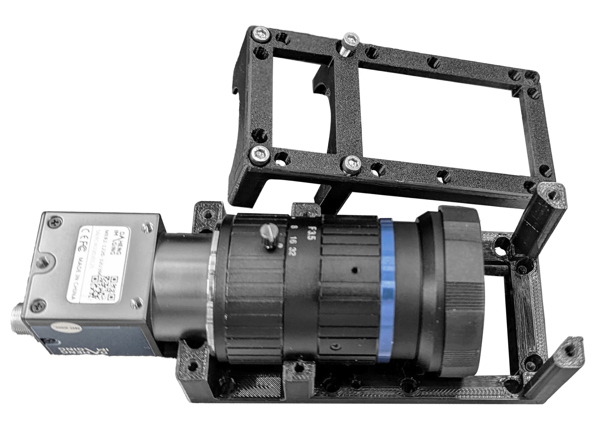

#Camera-container
 

{{BOM}}

[M3x15mm screw]: parts/mech/M3-15.md "{cat:mechanic}"
[M3x25mm screw]: parts/mech/M3-25.md "{cat:mechanic}"
[2.5mm Ball-end Allen key]: parts/tools/2.5mmBallEndAllenKey.md "{cat:tool}"
[Double Cube Len Holder B]: models/Double_Cube_Len_Holder/LightSheet_Remake-Double_Cube_Len_Holder_B.stl "{previewpage}"
[Double Cube Len Holder A]: models/Double_Cube_Len_Holder/LightSheet_Remake-Double_Cube_Len_Holder_A.stl "{previewpage}"
[Camera]:parts/elect/camera.md  "{cat:electronic}"
[Len]:parts/elect/len.md  "{cat:electronic}"

This part consists of a double cube adaptation designed to hold a specific type of lens. These parts are screwed together to maintain the position of the lens and allow for manual focus adjustments.

##Assembly:

## Connect the camera:{pagestep}

Thake your  [camera][Camera] and the [len][Len]{qty:1} and screw them together.

## Positionate the pieces:{pagestep}

1. Place the mounted [camera][Camera]{qty:1} on top of the [Double Cube Len Holder A]{qty: 1, cat: PrintedPart}, matching the diameters of the [len][Len] with the ones in the printed part.

2. Do the same thing with the [Double Cube Len Holder B]{qty: 1, cat: PrintedPart}, placing it on top of the other two.

## Screw: {pagestep}

Take the [M3x15mm][M3x15mm screw]{qty:2} and the [M3x25mm][M3x25mm screw]{qty:4} screws, place them into the plastic and tighten using a [2.5mm Ball-end Allen key]{qty:1}, leaving the shorter screws in the holes furthest from the lens, as shown in the image.

>i Ensure that the camera is positioned correctly.
