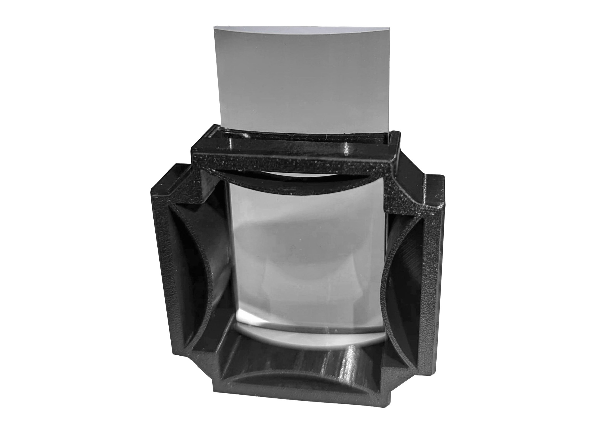
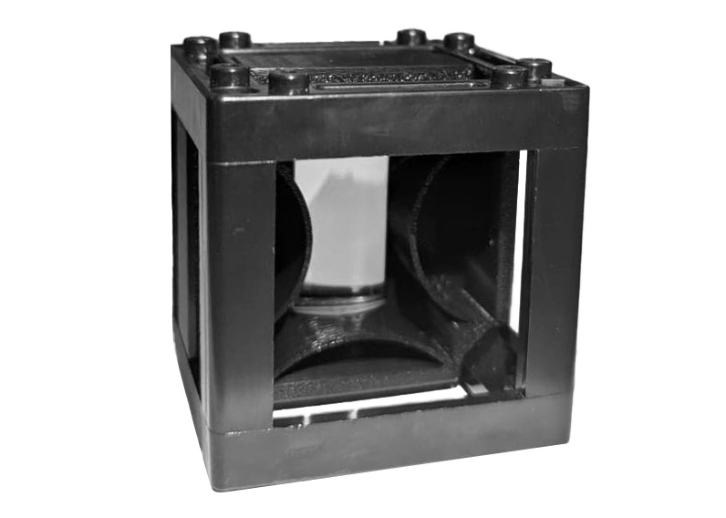

#Flex Holder for Cylindrical Lens

There are different types of lenses, which is why this model integrates a flex mechanism that allows to have lens with small width differences and still be held.

## Put it in a cube!:{pagestep}

Take one of your [UC2 cubes](UC2files.md) and place your assembled piece in it. You can purchase the cube or 3D print it, either option works fine.

>!  This Site is under construction.
