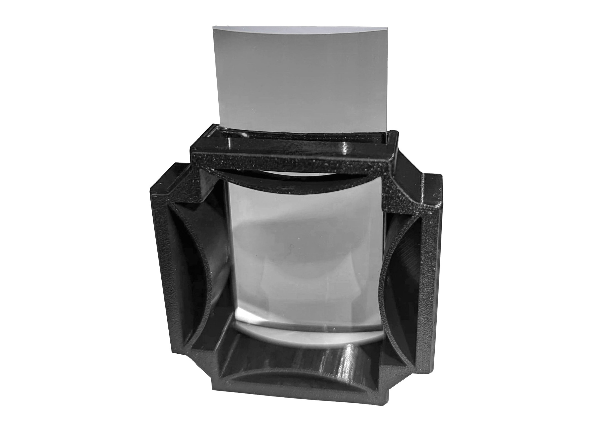

#Flex Holder for Cylindrical Lens

Cube insert

{{BOM}}

[M2.5 x 8 mm screw]: parts/mech/M2.5-8.md "{cat:mechanic}"

[2mm Ball-end Allen key]: parts/tools/2mmBallEndAllenKey.md "{cat:tool}"

[LJ1328L2-A Lens]: parts/optics/LJ1328L2-A.md "{cat:optical}"
[LJ1567L2-A Lens]: parts/optics/LJ1567L2-A.md "{cat:optical}"

[Taller Lens - Holder]: models/Flexure_cylindrical_lens_holder/Flexure_cylindrical_lens_holder-cyl-lens-holder-extra-tall.stl "{previewpage}"
[Lens - Holder]: models/Flexure_cylindrical_lens_holder/Flexure_cylindrical_lens_holder-cyl-lens-holder-flex.stl "{previewpage}"
[Holder Lid]: models/Flexure_cylindrical_lens_holder/Flexure_cylindrical_lens_holder-cyl-lens-holder-lid.stl "{previewpage}"

There are different types of lenses, which is why this model integrates a flex mechanism that allows to have lenses with small width differences, and still be held.

#Assembly:

##Screw the printed parts:{pagestep}

Take the flex desired piece, which can be the [Lens - Holder]{qty: 1, cat: PrintedPart} or the [Taller Lens - Holder]{qty: 1, cat: PrintedPart} and close it with the [Holder Lid]{qty: 1, cat: PrintedPart} using [2mm Ball-end Allen key]{qty:1} and 4 [M2.5 x 8 mm screw]{qty:4}

##Place the lens:{pagestep}
Take the [LJ1328L2-A][LJ1328L2-A Lens]{qty:1} or the [LJ1567L2-A][LJ1567L2-A Lens]{qty:1} lens and place it into the [Lens - Holder] or [Taller Lens - Holder] respectively.

## Put it in a cube!:{pagestep}

Take one of your [UC2 cubes](UC2files.md) and place your assembled piece in it. You can purchase the cube or 3D print it, either option works fine.

