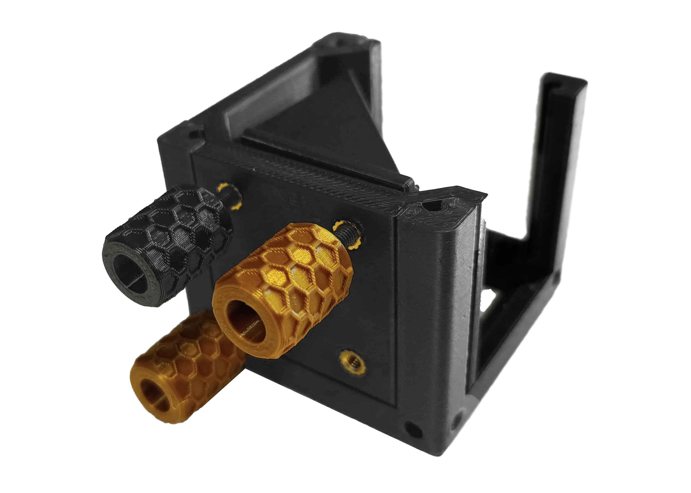
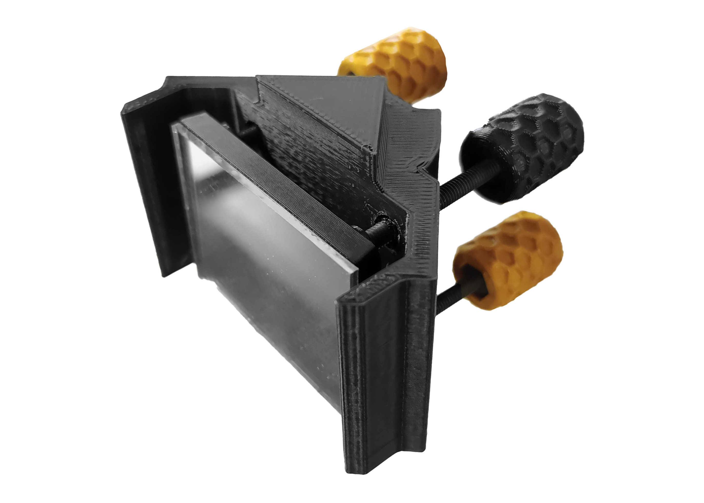
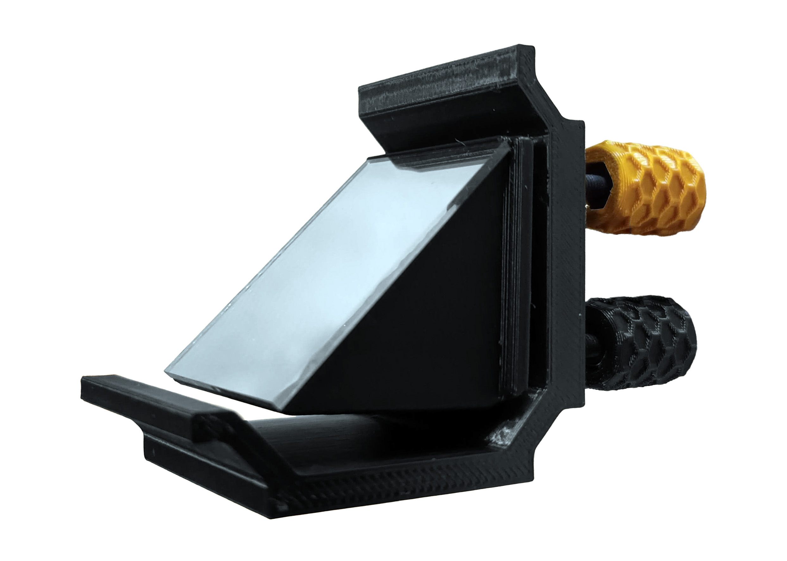
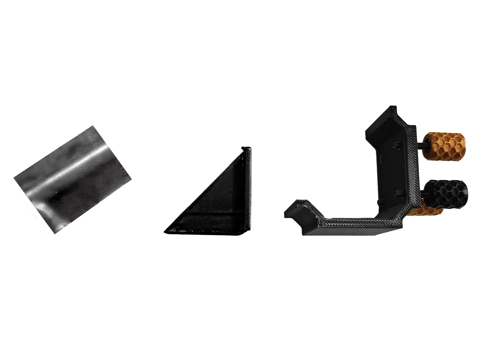
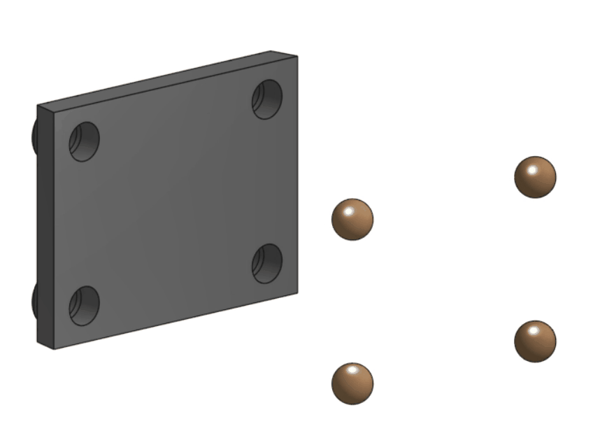
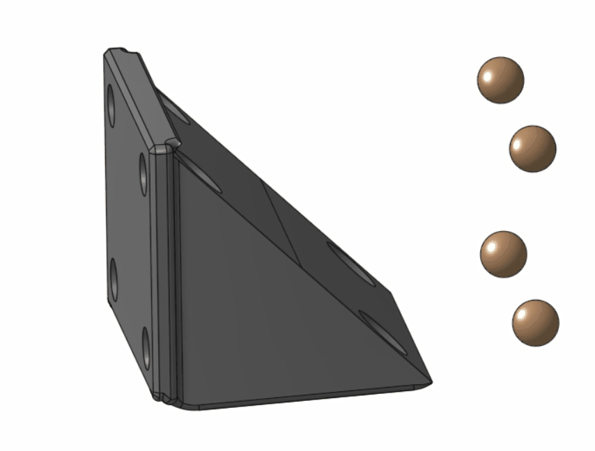
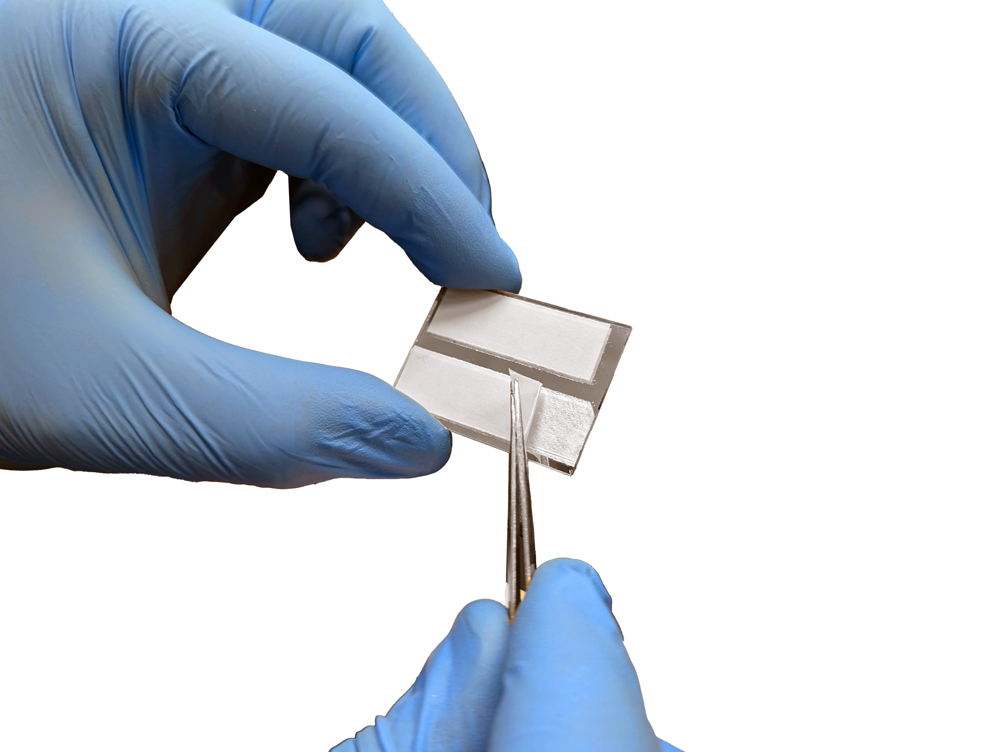
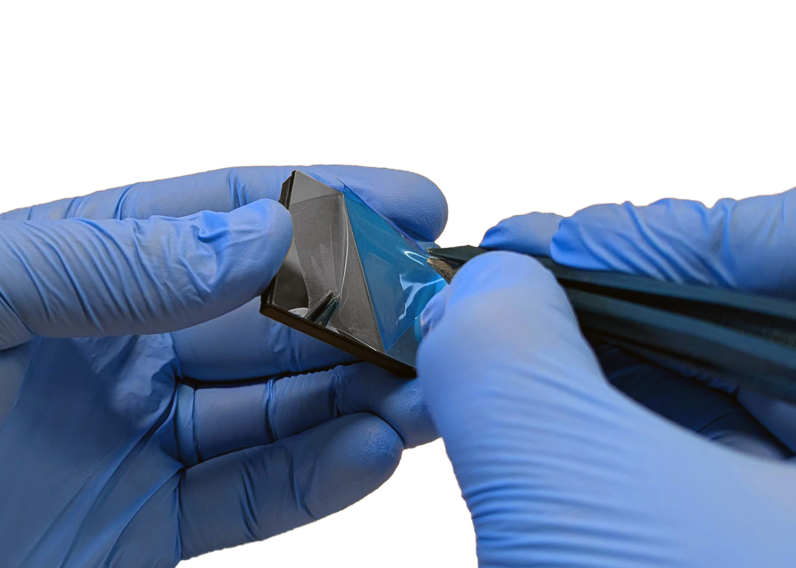
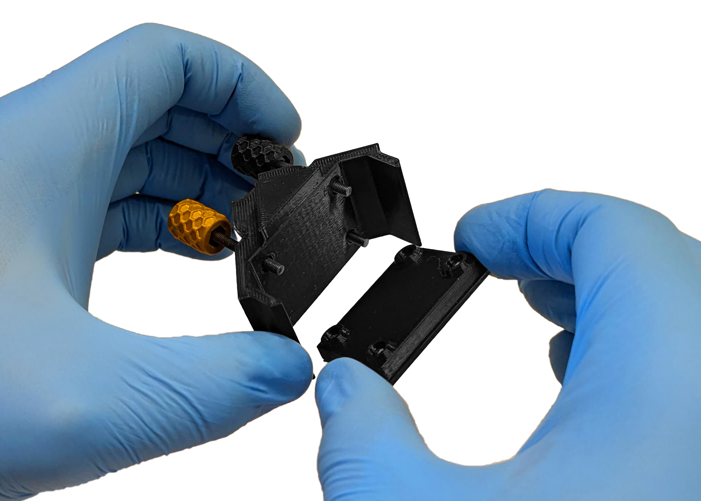

#Kinematic Mounts

{{BOM}}

[M3x20mm screw]: parts/mech/M3-20.md "{cat:mechanic}"
[M3 nut]: parts/mech/nuts.md "{cat:mechanic}"
[2.5mm Ball-end Allen key]: parts/tools/2.5mmBallEndAllenKey.md "{cat:tool}"
[Heat insert]: parts/mech/Hinsert.md "{cat:mechanic}"
[Round-Magnets]: parts/mech/magnets.md "{cat: mechanic}"

[Soldering iron]: parts/tools/soldiron.md "{cat:tool}"
[Tweezers]: parts/tools/tweezers.md "{cat:tool}"

[Knob]: models/Kinematic_Mirrors/Knob.stl "{previewpage}"
[Side-Kinematic-Mount-LIBREhub]: models/Kinematic_Mirrors/Side-Kinematic-Mount-LIBREhub.stl "{previewpage}"

[Diagonal-Kinematic-Mount-LIBREhub]:models/Kinematic_Mirrors/Diagonal-Kinematic-Mount-LIBREhub.stl "{previewpage}"
[Diagonal-Mirror-Surface-LIBREhub]:models/Kinematic_Mirrors/Diagonal-Mirror-Surface-LIBREhub.stl "{previewpage}"
[Side-Mirror-Surface-LIBREhub]:models/Kinematic_Mirrors/Side-Mirror-Surface-LIBREhub.stl "{previewpage}"

When using lasers, refractive elements for the beams are essential, even more the ones that can help control how and where exactly the light goes. In these models, the mirror can be calibrated from 3 knobs, 2 gold ones to move and a black one that is to be static

For this controlling system, we have two options depending on the user's needs.

- ## Diagonal Mirror:

- ## Side Mirror:

---

# Assemble the kinematic mounts:

## Knobs:{pagestep}

Place the [nut][M3 nut]{qty: 3} into the [knob][Knob]{qty: 3, cat:printedpart} and insert the [screw][M3x20mm screw]{qty: 3} tightly using the [Allen Key][2.5mm Ball-end Allen key]{qty:1}:

>? Please ensure that your screws are magnetic, as non-magnetic screws will not function properly with the magnets.

## Heat set inserts:{pagestep}

Use the [Soldering iron]{qty: 1} to place the [heat inserts][Heat insert]{qty: 3} into the [diagonal kinematic mount][Diagonal-Kinematic-Mount-LIBREhub]{qty: 1, cat:printedpart} or the [side kinematic mount][Side-Kinematic-Mount-LIBREhub]{qty: 1, cat:printedpart}, depending on the model you need.

## Place the magnets:{pagestep}

Place the [Round-Magnets]{qty: 4} in the [Diagonal-Mirror-Surface][Diagonal-Mirror-Surface-LIBREhub]{qty: 1, cat:printedpart} holes and press the flat side surface against the table to ensure that the surface stays completely flat. If you want to mount them for the [side kinematic mount][Side-Kinematic-Mount-LIBREhub], follow the same steps on the [Side-Mirror-Surface][Side-Mirror-Surface-LIBREhub]{qty: 1, cat:printedpart} but press the magnets into the piece and against the table so all the balls reach the opposite surface.

>! **Caution** 
>! The mirror surface must be flat so the mirror itself can be mounted

## Mount the knobs:{pagestep}

Be sure to leave them all at the same approximate distance so they are easier to use later.

## Mount the Mirror:{pagestep}

1. Add some double-sided tape to the unprotected side of the mirror, peel off the plastic, and add it to the flat surface of the [Diagonal-Mirror-Surface][Diagonal-Mirror-Surface-LIBREhub]

2. Once added, peel off the protective plastic from the mirror with the [tweezers][Tweezers]{qty:1}

3. Place the mirror holder onto the screw tips of the [kinematic mount][Diagonal-Kinematic-Mount-LIBREhub], the [magnets][Round-Magnets] will hold it in position.

>! **Caution** 
>! If the screw tips are not flat, the kinematic mirrors will not be as precise as they can be; therefore, it is necessary to [**sand them**](Sanding.md)

## Put it in a cube!:{pagestep}

Take one of your [UC2 cubes](UC2files.md) and place your assembled Kinematic Mirror in it. You can purchase the cube or 3D print it, either option works fine.

