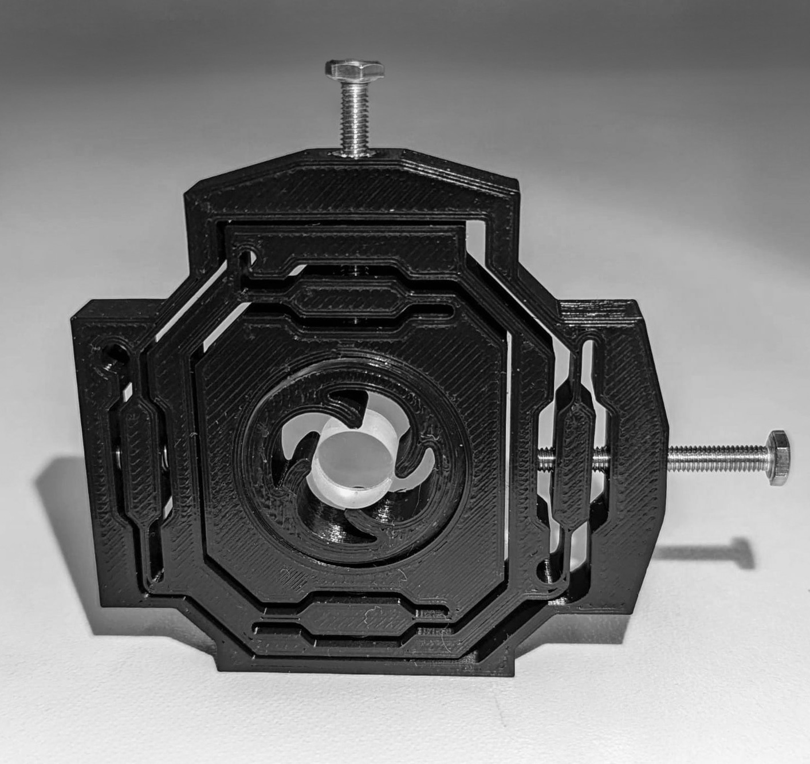
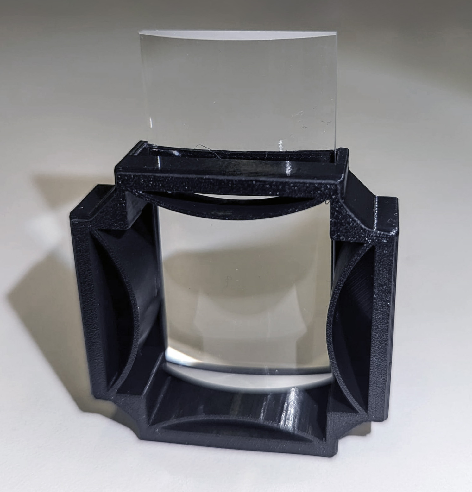
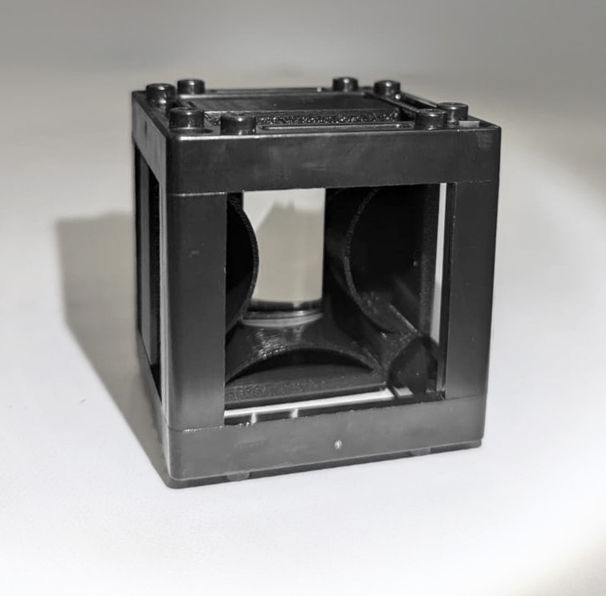
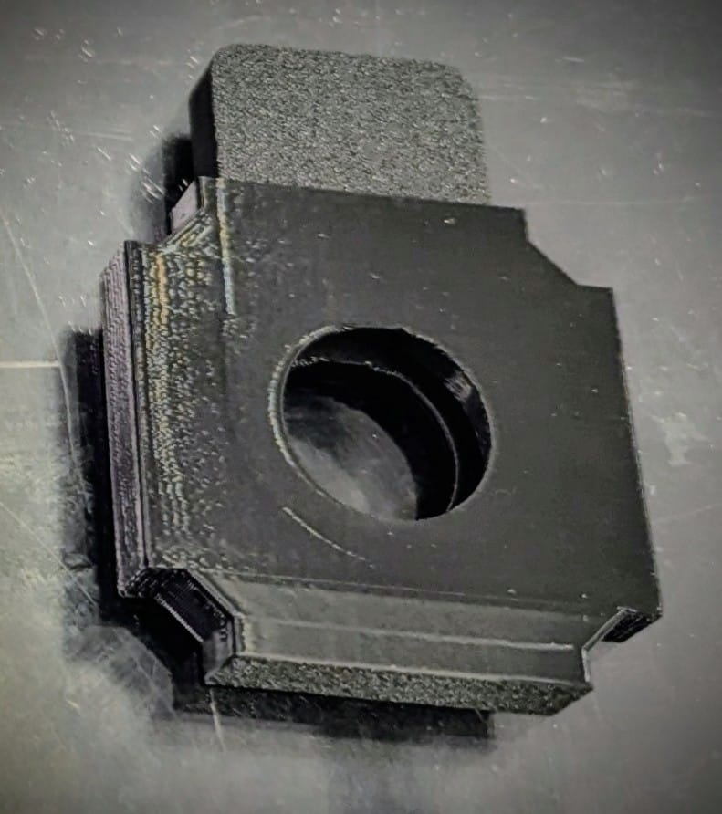
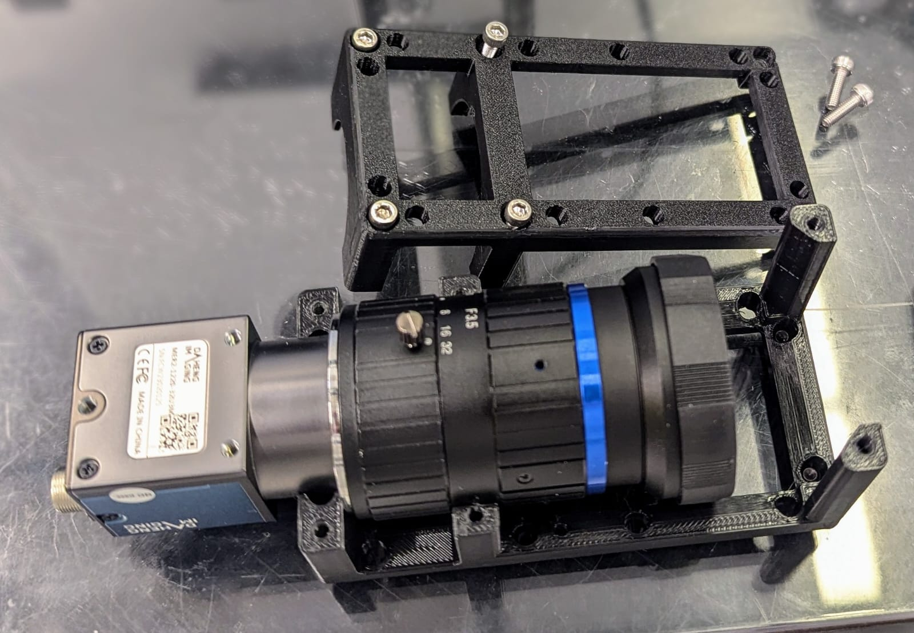

# Cube-based Light-sheet Apparatus for Versatile 3d-imaging Experiments (CLAVE) 

Appropriate technology open source light sheet microscope design, for 3d imaging and high-throughput droplet cytometry.
This is a modification of the OpenUC2 light sheet design - a project that can be explored by [website](https://openuc2.de) and [GitHub](https://github.com/openUC2/UC2-GIT). This version has been developed as part of a [crowd funded project](https://experiment.com/projects/developing-a-low-cost-high-sensitivity-solution-for-phage-viral-load-detection) on experiment.com by Tobias Wenzel and Benedict Diederich. In the Wenzel Lab, Matías Hurtado has also contributed to the design of several cubes, and the re-design of Inventor designs of [UC2 cubes in OnShape](https://cad.onshape.com/documents/6ad90b1b9211810137d71b1d/w/b1b0cc05a0494bf4bc912f91/e/37e5ce9fc21af2a3e931ec46?configuration=Distances%3D0.03%2Bmeter&renderMode=0&uiState=668f4aab4587f461c0a71ce5).

Follow us! [#twitter](https://twitter.com/WenzelLab), [#YouTube](https://www.youtube.com/@librehub), [#LinkedIn](https://www.linkedin.com/company/92802424), [#instagram](https://www.instagram.com/wenzellab/), [#Printables](https://www.printables.com/@WenzelLab), [#LIBREhub website](https://librehub.github.io), [#IIBM website](https://ingenieriabiologicaymedica.uc.cl/en/people/faculty/821-tobias-wenzel)

## Build your own!

Illumination arm:
1) Fiber coupler, colimator, 5mm mask, all mounted on one threaded UC2 insert. Fiber coupler and colimator: Thorlabs AD11F with F280FC-A. The 5mm mask was 3d printed to cut the beam to the optimal size for the Powell lense.
3) Powell-lense and optional slit
   

   
  

4) cylindrical lense f=150mm (or 100mm in cube 5, or 50mm in cube 6)
   

  
 
  

  
5) kinematic mirror (optional if using a straight illumination arm or a shorter focal length cylindrical lense)
6) empty
7) sample holder
8) XYZ stage for sample
   
Detection arm:
10) 1- 5x Objective
  2- Focus motor 
11) 1- Optical filter

   

  
  

  
   2- Tube-lense and camera
   
   

  
  

  
There is also crontol electronics, a playstation controller, and a computer running Ubuntu

## Contribute

This is an open project in the Wenzel Lab in Santiago, Chile. If you have any suggestions to improve it or add any additional functions make a pull-request or [open an issue](https://github.com/wenzel-lab/light-sheet-microscope/issues/new).
For interactions in our team and with the community applies the [GOSH Code of Conduct](https://openhardware.science/gosh-2017/gosh-code-of-conduct/).

## License

[CERN OHL 2W](LICENSE). This project is Open Source Hardware - please acknowledge us when using the hardware or sharing modifications.
