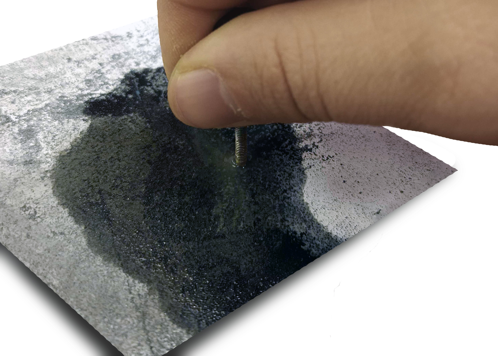
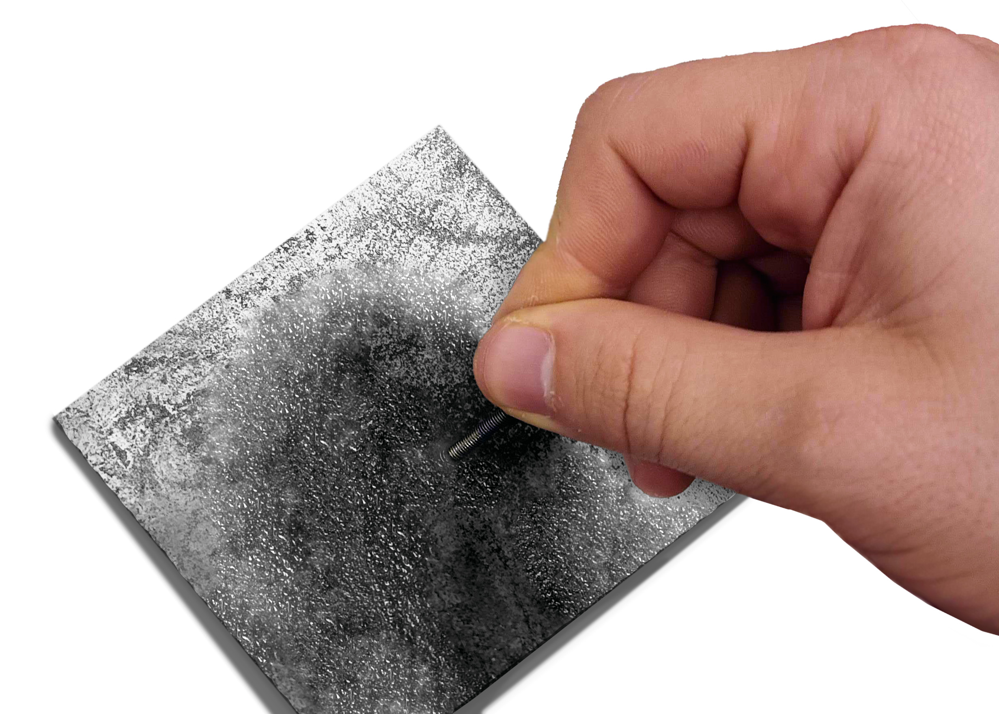
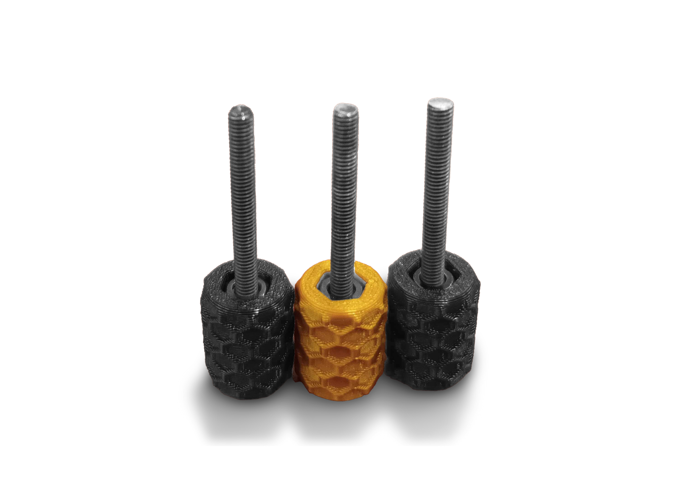
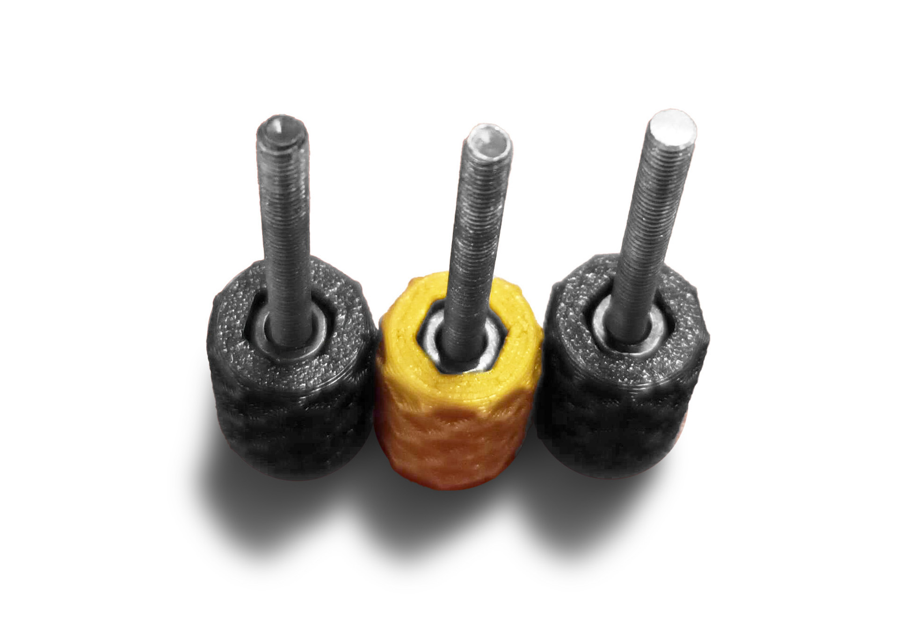

#Prepare the screws: 
To make the kinematic mounts work more precisely it is necessary to sand the screws so they have a smooth tip surface, sand them until you cannot notice any irregularities on it. Otherwise, it might still generate bumps while rotating the knobs.

>! Use metal water sandpaper for better results

Scratch against the tip flat and generate a small chamfer if possible.

The screws will gradually become more smooth

