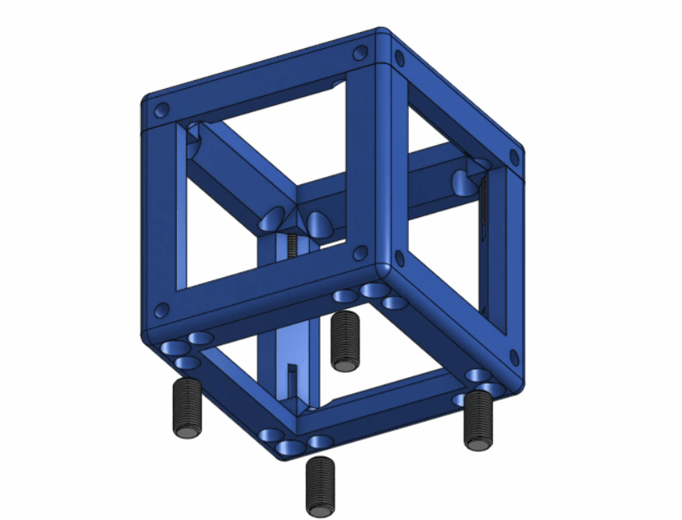

# UC2 Base Cubes

{{BOM}}

[M3x15mm screw]: parts/mech/M3-15.md "{cat:mechanic}"
[M5x10mm inner screw]: parts/mech/Inner-M5-10.md "{cat:mechanic}"
[2.5mm Ball-end Allen key]: parts/tools/2.5mmBallEndAllenKey.md "{cat:tool}"
[3.5mm Ball-end Allen key]: parts/tools/3.5mmBallEndAllenKey.md "{cat:tool}"

[Base Cube]: models/Base_Cube/Single_Base_Cube.stl "{previewpage}"
[Cube Top]:models/Base_Cube/Single_Top_Cube.stl "{previewpage}"
[Puzzle Base]:models/Base_Cube/Base_puzzle.stl "{previewpage}"

* To assemble these printed cubes you will need 4 [M3x15mm screw]{qty:4} for the [Cube Top]{qty:1, cat:printedpart} and an [M3 Allen key][2.5mm Ball-end Allen key]{qty:1} to insert them into the [Base Cube]{qty:1, cat:printedpart}. 

* To place one or many cubes into the [Puzzle Base]{qty:1, cat:printedpart} insert 4 [M5x10mm inner screw]{qty:4} using the [M4 Allen key][3.5mm Ball-end Allen key]{qty:1} into the [Base Cube], then connect both parts.

