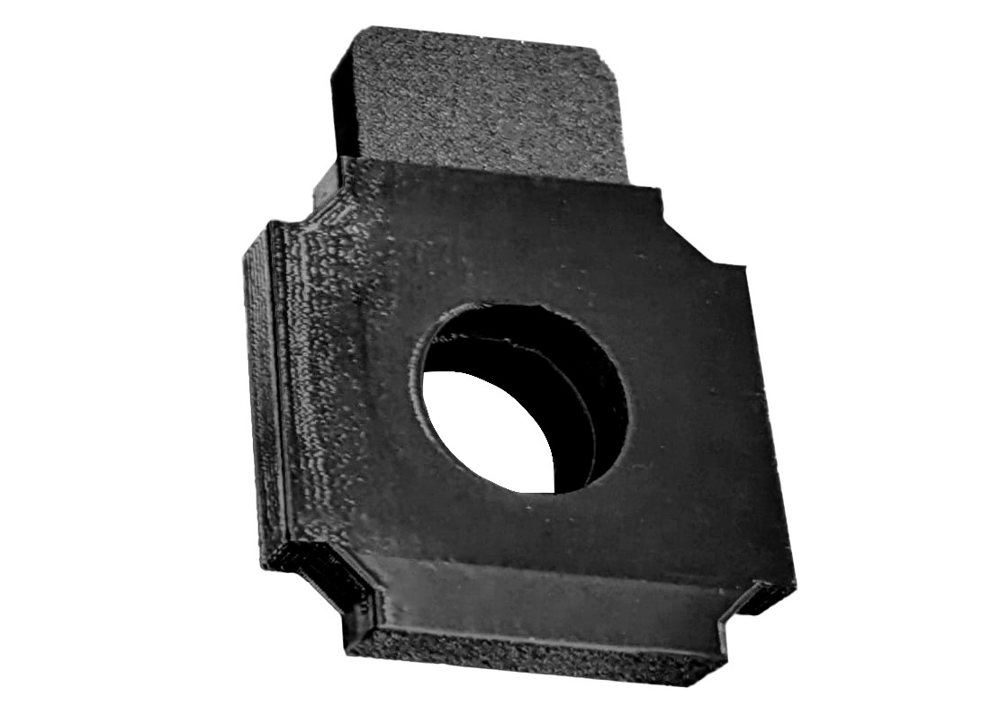
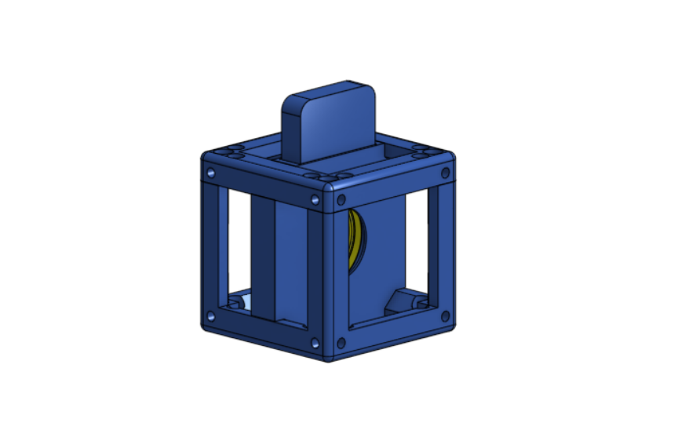

# Filter Holder

Cube insert

{{BOM}}

[Filter lens]: parts/optics/Filter_lens.md "{cat: Optical}"

[Filter slide holder]:models/Filter_Holder/Holder-Filter-Slide-25-mm.stl "{previewpage}"
[Filter Slide]:models/Filter_Holder/Filter-Slide-25-mm.stl "{previewpage}"

To assemble this piece is simple. 

##Step 1:
Place the [Filter lens]{qty:1} that you want to use, into the [Filter Slide]{qty: 1, cat:printedpart}

##Step 2:
Place that into the [Filter slide holder]{qty: 1, cat:printedpart}

##Step 3: Put it in a cube!

Take one of your [UC2 cubes](UC2files.md) and place your assembled piece in it. You can purchase the cube or 3D print it, either option works fine.

>i You can switch the filter lens by simply taking out the [Filter Slide] of the cube

