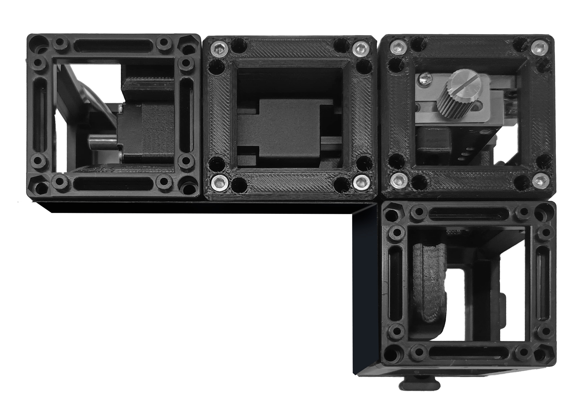

# Parts Gallery

####Here you can access and download all the components 

|||
|---|---|
|[Adjustable_Slit](adjustable_slit.md)|[Camera container](Camera-container.md)|
||
|[Laser Control-Interface](control-Interface.md) | [Cylindrical Lens Flex Holder](Cylindrical_Lens_Flex.md)
|  | 
|[Filter Holder](filter_holder.md)|[Kinematic Mirrors](Kinematic_Mirrors.md) 
|||
|[Power lens XY aligner](Power_lens_XY_aligner.md)|[Stepper_Motor_Container](Stepper_Motor_Container.md)
| | |
|Make your own versions with our [**Onshape editable file**](https://cad.onshape.com/documents/6ad90b1b9211810137d71b1d/w/b1b0cc05a0494bf4bc912f91/e/37e5ce9fc21af2a3e931ec46?configuration=Distances%3D0.04%2Bmeter&renderMode=0&uiState=66e9882abbe5d66cb7f6e046)
|

