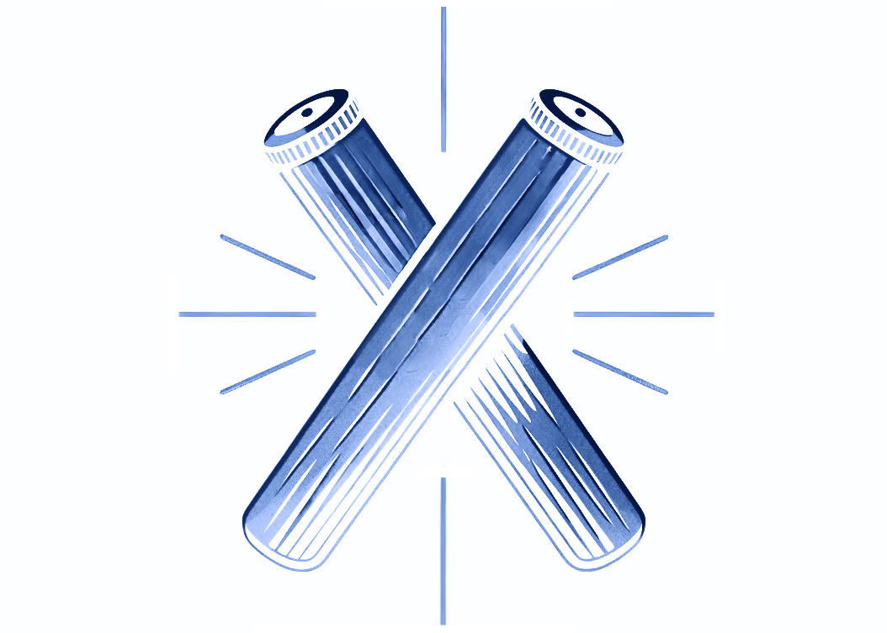
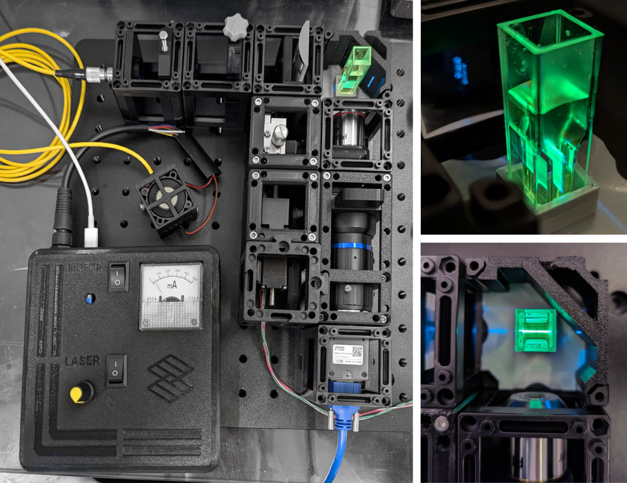
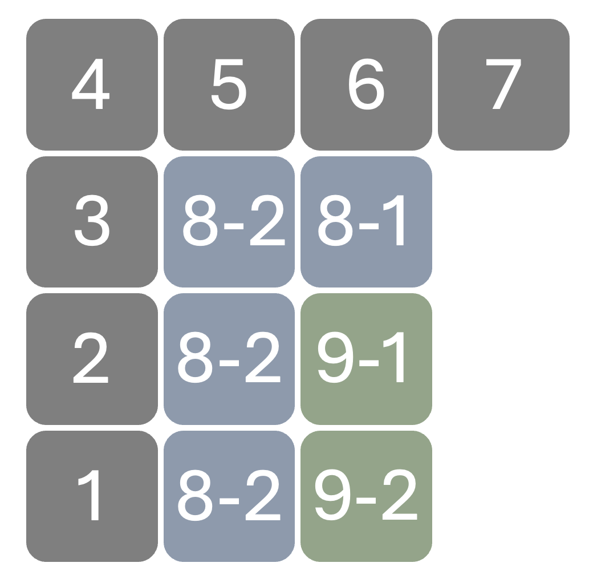

# CLAVE Microscope

## **CLAVE:**  Cube-based Light-sheet Apparatus for Versatile 3D-imaging Experiments

=

Appropriate technology open source light sheet microscope design, for 3d imaging and high-throughput droplet cytometry. This is a modification of the OpenUC2 light sheet design - a project that can be explored by the [**website** ](https://openuc2.de/)and [**GitHub**](https://github.com/openUC2/UC2-GIT). This version has been developed as part of a [**crowd-funded project**](https://experiment.com/projects/developing-a-low-cost-high-sensitivity-solution-for-phage-viral-load-detection) on experiment.com by [Tobias Wenzel](https://librehub.github.io/people/tobias_wenzel/index.html) and [Benedict Diederich](https://openuc2.com/author/benedi/). In the Wenzel Lab, [Matías Hurtado](https://librehub.github.io/people/matias_hurtado/index.html) has also contributed to the design of several cubes, and the re-design of Inventor designs of [**UC2 cubes in OnShape.**](https://cad.onshape.com/documents/6ad90b1b9211810137d71b1d/w/b1b0cc05a0494bf4bc912f91/e/37e5ce9fc21af2a3e931ec46?configuration=Distances%3D0.03%2Bmeter&renderMode=0&uiState=668f4aab4587f461c0a71ce5)

#Build your own:

##Navigation:

 * [Parts Gallery](gallery.md)

* [Prepare the pieces](Prepare.md)

* [Build your UC2](UC2files.md)

---

##Follow us:

  * [Twitter](https://twitter.com/WenzelLab), 
 * [YouTube](https://www.youtube.com/@librehub>), 
  * [LinkedIn](https://www.linkedin.com/company/92802424), 
*   [Instagram](https://www.instagram.com/wenzellab/), 
 *  [Printables](https://www.printables.com/@WenzelLab/models) &  [Thingiverse](https://www.thingiverse.com/libre-hub/designs)
* [LIBREhub website](https://librehub.github.io/),  
* [IIBM website](https://ingenieriabiologicaymedica.uc.cl/en/people/faculty/821-tobias-wenzel)

##Contribute:
This is an open project in the Wenzel Lab in Santiago, Chile. If you have any suggestions to improve it or add  additional functions make a pull-request or [open an issue](https://github.com/wenzel-lab/light-sheet-microscope/issues/new). For interactions in our team and with the community applies the [GOSH Code of Conduct](https://openhardware.science/gosh-2017/gosh-code-of-conduct/).

##License:
[CERN OHL 2W.](https://github.com/wenzel-lab/light-sheet-microscope/blob/main/LICENSE) This project is Open Source Hardware - please acknowledge us when using the hardware or sharing modifications.

