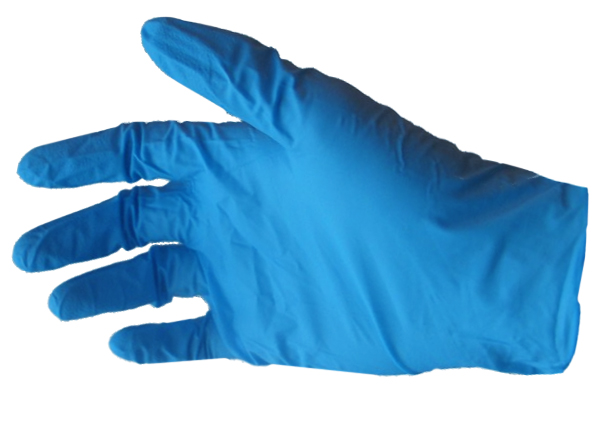

# Nitrile gloves

They safeguard sensitive electronic components from contamination, oils, and static discharge.

These gloves prevent potential damage during assembly, repair, or handling of electronic devices.

*Supplier:* [bioquimica.cl](https://www.bioquimica.cl/guantes-de-nitrilo-sin-polvo-caja-100-un)