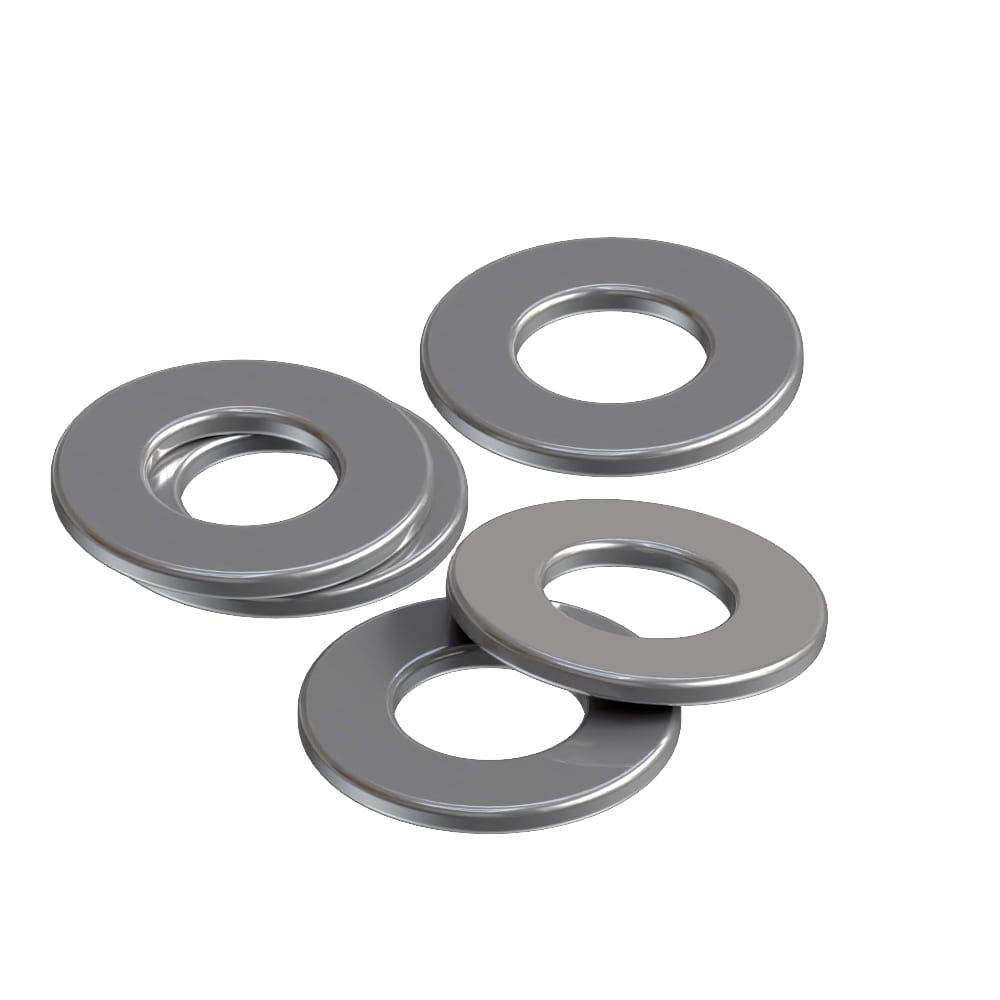

---
PartData:
    Specs:
        Type: M3
        Material: Stainless steel
        Supplier:  -[Pernos kim](https://pernos-kim.negocio.site/)

---
# Screw washer

* Small disk used with screws or bolts. It distributes the load and protects surfaces. It prevents damage and provides stability. Different materials and types are available for specific applications. It enhances the performance of the fastening system.

