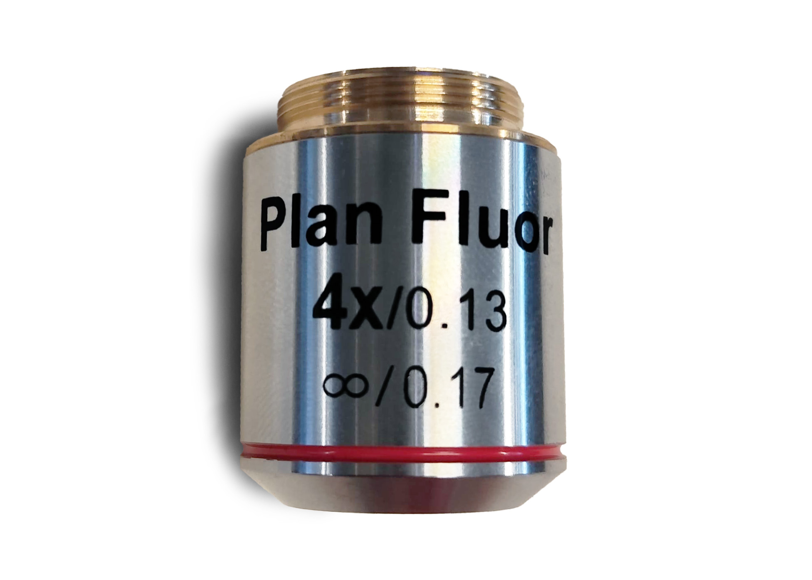

# Objective

There are different types of objectives, depending on the experiment is which one you might need.

In this case, we are using a 4X/0.13 objective.

_Supplier_: [Thorlabs](https://www.thorlabs.com/thorproduct.cfm?partnumber=RMS4X-PF)

