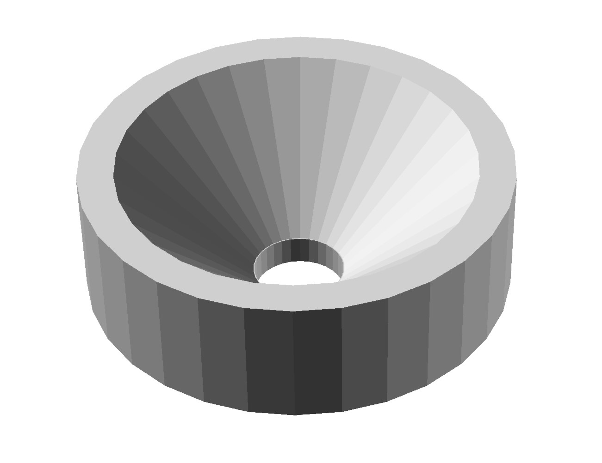

# Pi camera lens tool

This should come with the [Raspberry Pi Camera Module](http://localhost:6178/live/editor1/parts/elect/rpi-camera-v2.html). If it is missing, you can 3D print a workaround lens remover.

